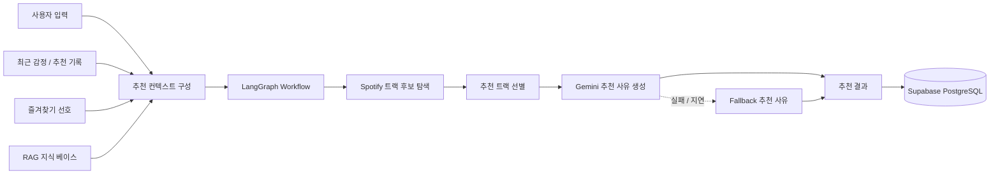
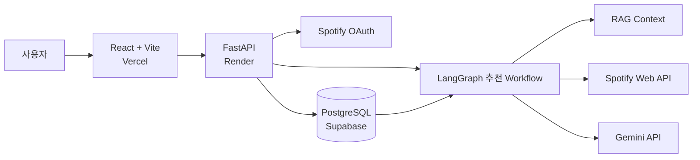

# Mood Sync

> 감정과 상황, 사용자 취향을 반영해 음악을 추천하는 AI 음악 큐레이션 서비스

Mood Sync는 사용자의 **현재 감정, 상황, 원하는 분위기**를 입력받아 Spotify 트랙을 추천하고, 최근 감정 기록과 추천 이력, 즐겨찾기 등의 사용자 맥락을 함께 반영해 개인화된 음악 추천을 제공하는 서비스입니다.

단순히 하나의 감정 라벨에 따라 곡을 추천하는 방식이 아니라, 사용자의 입력과 누적된 기록을 조합해 추천 컨텍스트를 구성하고 **LangGraph · RAG · Spotify API · Gemini**를 활용해 추천 결과와 곡별 추천 사유를 생성합니다.

* **개발 형태:** 개인 프로젝트
* **담당 범위:** 기획 · UI/UX · 프론트엔드 · 백엔드 · AI 추천 파이프라인 · DB 설계 · 배포
* **Frontend:** React 19 + Vite
* **Backend:** FastAPI
* **AI:** LangGraph + RAG + Gemini
* **Database:** PostgreSQL (Supabase)
* **Deployment:** Vercel + Render + Supabase

## 데모

🌐 **배포 서비스**

[https://mood-sync-mu.vercel.app/](https://mood-sync-mu.vercel.app/)

### 데모 확인 방법

Mood Sync는 **Spotify OAuth 로그인과 데모 모드**를 모두 지원합니다.

Spotify 계정이 없어도 로그인 화면에서 데모 모드를 선택해 주요 추천 흐름을 확인할 수 있습니다.

데모에서는 다음과 같은 시나리오를 제공합니다.

* 집중
* 재즈
* 드라이브
* 몽환

Spotify 계정으로 로그인하면 실제 사용자 계정을 기반으로 추천 결과 저장, 즐겨찾기, 감정 기록 등의 기능을 이용할 수 있습니다.

## 프로젝트 소개

Mood Sync는 다음 정보를 함께 활용해 사용자에게 맞는 추천 컨텍스트를 구성합니다.

* 사용자가 선택한 현재 감정
* 자유롭게 입력한 현재 상황
* 원하는 분위기 태그
* 최근 감정 기록
* 최근 추천 기록
* 즐겨찾기에서 추출한 사용자 선호
* RAG 기반 추천 지식 컨텍스트
* Spotify 트랙 메타데이터

```text
현재 감정
   +
현재 상황
   +
원하는 분위기
   +
최근 감정 / 추천 기록
   +
즐겨찾기 선호
   +
RAG 컨텍스트
   ↓
개인화 추천 컨텍스트
   ↓
Spotify 트랙 추천
   ↓
곡별 추천 사유 생성
```

추천 결과는 데이터베이스에 저장되며 대시보드와 히스토리를 통해 이전 감정과 음악 추천 기록을 다시 확인할 수 있습니다.

## 핵심 기능

### Spotify OAuth 로그인

* Spotify OAuth를 활용한 사용자 로그인
* 인증 정보를 HTTP-only Cookie 기반으로 관리
* 로그인 상태에 따른 보호 라우트 처리
* Spotify 사용자 환경과 연결된 서비스 이용

### 데모 모드

* Spotify 계정 없이 주요 기능 체험 가능
* 집중, 재즈, 드라이브, 몽환 프리셋 제공
* 로그인 절차 없이 추천 흐름 확인 가능

### AI 음악 추천

* 현재 감정, 자유 입력 상황, 분위기 태그를 조합해 추천 컨텍스트 생성
* 최근 감정 및 추천 기록을 활용한 개인화
* 즐겨찾기 데이터를 활용한 사용자 음악 선호 반영
* RAG 기반 추천 지식 컨텍스트 활용
* LangGraph 기반 추천 워크플로우 구성
* Spotify API를 활용한 트랙 후보 탐색 및 메타데이터 조회
* Gemini를 활용한 곡별 추천 사유 생성
* LLM 응답 지연 또는 실패 상황을 위한 fallback 처리

### 대시보드

* 오늘의 감정 기록 확인
* 최근 감정 기록 확인
* 최근 추천 음악 확인
* 사용자 활동을 한 화면에서 요약

### 감정 및 추천 히스토리

* 월별 감정 기록 조회
* 과거 추천 결과 확인
* 감정과 당시 추천 음악을 함께 확인
* 저장된 기록 삭제

### 즐겨찾기

* 추천받은 Spotify 트랙 저장
* 즐겨찾기 추가 및 해제
* 저장한 음악 목록 조회
* 즐겨찾기 데이터를 이후 추천 컨텍스트에 활용

### 마이페이지

* 로그인 사용자 정보 확인
* 최근 감정 기록 수 확인
* 즐겨찾기 곡 수 확인

## 추천 파이프라인



### 추천 흐름

1. 사용자가 현재 감정, 상황, 원하는 분위기를 입력합니다.
2. 최근 감정 및 추천 기록과 즐겨찾기에서 사용자 맥락을 수집합니다.
3. RAG 검색 결과와 사용자 정보를 조합해 추천 컨텍스트를 구성합니다.
4. LangGraph 워크플로우를 통해 추천 단계를 순차적으로 처리합니다.
5. Spotify API에서 추천 후보 트랙과 메타데이터를 조회합니다.
6. 후보 중 최종 추천 트랙을 선별합니다.
7. Gemini가 사용자 맥락과 트랙 정보를 바탕으로 추천 사유를 생성합니다.
8. 생성 결과를 DB에 저장하고 추천 화면에 표시합니다.

## 주요 구현 포인트

### 다중 사용자 맥락 기반 개인화

단순한 감정 라벨만 사용하는 대신 현재 상황, 원하는 분위기, 최근 기록, 추천 이력, 즐겨찾기 등을 함께 활용해 추천 컨텍스트를 구성했습니다.

이를 통해 동일한 감정을 선택하더라도 사용자의 상황과 과거 기록에 따라 다른 추천 흐름을 만들 수 있도록 설계했습니다.

### LangGraph 기반 추천 워크플로우

추천 로직을 하나의 긴 처리 과정으로 구성하지 않고, 컨텍스트 수집부터 후보 탐색, 트랙 선별, 추천 사유 생성까지 단계별 워크플로우로 분리했습니다.

각 단계의 역할을 분리해 추천 파이프라인을 확장하거나 수정하기 쉽도록 구성했습니다.

### RAG 기반 추천 맥락 보강

사용자 입력만으로 부족할 수 있는 추천 맥락을 보완하기 위해 RAG 기반 추천 지식 베이스를 활용했습니다.

검색된 컨텍스트를 사용자 감정 및 상황 정보와 함께 추천 과정에 전달하도록 구성했습니다.

### LLM 실패 대응

Gemini 응답이 지연되거나 정상적으로 생성되지 않는 경우에도 추천 결과 화면이 비어 있지 않도록 fallback 추천 사유를 제공합니다.

필요한 경우 이후 비동기 보강을 통해 추천 문구를 개선할 수 있도록 구성해 외부 LLM 응답 상태가 전체 사용자 경험을 중단시키지 않도록 했습니다.

### 사용자 기록 기반 추천 경험

추천 결과와 감정 기록을 저장하고, 즐겨찾기와 최근 추천 데이터를 이후 추천에 다시 활용하도록 설계했습니다.

단발성 음악 추천이 아니라 사용자의 기록이 누적될수록 추천에 활용할 수 있는 맥락이 늘어나는 구조를 구성했습니다.

### OAuth와 데모 모드 병행

실제 Spotify OAuth 기반 서비스 사용 흐름과 별도로 데모 모드를 구현했습니다.

외부 계정 연동 없이도 면접관이나 사용자가 주요 추천 기능을 바로 체험할 수 있도록 구성했습니다.

## 기술 스택

| 구분                  | 기술                                                       |
| ------------------- | -------------------------------------------------------- |
| Frontend            | React 19, Vite, React Router                             |
| Styling             | Tailwind CSS                                             |
| Backend             | FastAPI, SQLAlchemy, Alembic                             |
| AI Workflow         | LangGraph                                                |
| AI / Recommendation | RAG, Gemini API                                          |
| Database            | PostgreSQL, Supabase                                     |
| Authentication      | Spotify OAuth, HTTP-only Cookie                          |
| External API        | Spotify Web API                                          |
| Deployment          | Vercel (Frontend), Render (Backend), Supabase (Database) |

## 시스템 아키텍처



## 배포 구성

```text
사용자
  ↓
Vercel
React + Vite Frontend
  ↓
Render
FastAPI Backend
  ↓
Supabase
PostgreSQL Database

FastAPI Backend
  ├─ Spotify Web API
  └─ Gemini API
```

* 프론트엔드는 **Vercel**에 배포했습니다.
* FastAPI 백엔드는 **Render**에서 실행합니다.
* PostgreSQL 데이터베이스는 **Supabase**를 사용합니다.
* 프론트엔드와 백엔드가 분리된 구조이므로 배포 환경에 맞춰 API 주소와 CORS 설정을 관리합니다.
* 운영 환경에서는 인증 Cookie가 HTTPS 환경에 맞도록 설정됩니다.

## 데이터 모델

주요 데이터 모델은 다음과 같습니다.

### `users`

* 사용자 로그인 정보 저장
* Spotify OAuth 사용자 또는 데모 사용자 구분

### `mood_records`

* 감정 입력 기록 저장
* 감정, 텍스트, 생성 시점 저장

### `recommendations`

* 추천 결과 저장
* 선택한 감정, 입력 문장, 분위기 태그, RAG/LLM 컨텍스트, 생성 프로필, 추천 트랙 정보 저장

### `favorites`

* 즐겨찾기한 트랙 저장
* 트랙 메타데이터, 추천 사유, 감정 맥락 저장

## 실행 방법

### 프론트엔드

```bash
cd client
npm install
npm run dev
```

### 백엔드

```bash
cd server
python3 -m pip install -r requirements.txt
uvicorn app.main:app --reload --host 0.0.0.0 --port 8000
```

## 환경 변수

배포 또는 로컬 연동 시 아래 값들이 필요합니다.

* `DATABASE_URL`
* `FRONTEND_URL`
* `VITE_API_BASE_URL`
* `SPOTIFY_CLIENT_ID`
* `SPOTIFY_CLIENT_SECRET`
* `OPENAI_API_KEY`
* `GEMINI_API_KEY`
* `ENVIRONMENT`

## API 요약

* `GET /api/health`
* `GET /api/v1/auth/spotify/login`
* `GET /api/v1/auth/spotify/callback`
* `POST /api/v1/auth/demo/start`
* `POST /api/v1/mood/recommend`
* `GET /api/v1/mood/dashboard`
* `GET /api/v1/mood/history`
* `GET /api/v1/favorites`

## 참고

* 루트 `Dockerfile`은 프론트 빌드와 FastAPI 실행을 함께 처리하도록 구성되어 있습니다.
* Spotify 트랙 카드에는 Spotify 원본 링크와 앨범 이미지를 함께 사용합니다.
* 추천 사유 생성은 Gemini를 사용하되, 실패 시에도 화면이 비지 않도록 fallback 로직이 있습니다.
